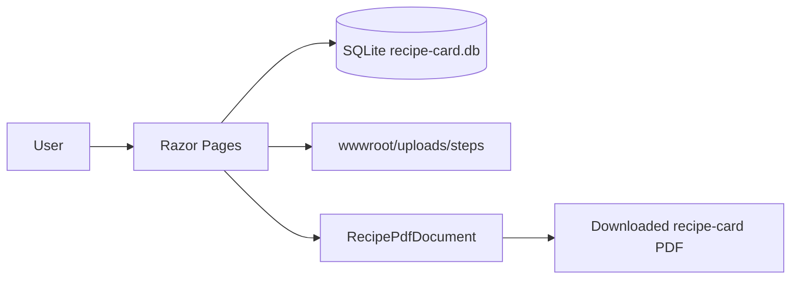

# Recipe Card Core Implementation

## Overview

Build the smallest usable recipe-card workflow for Phê La-style operational recipes:

```text
Ingredient catalog → recipe card → ingredient quantities → ordered steps + one image → preview → PDF
```

A user creates and exports one recipe at a time. A combined recipe booklet is not part of this plan.

## Approved Decisions

| Area | Decision | Reason |
|---|---|---|
| Web framework | ASP.NET Core Razor Pages on .NET 10 | One server-rendered project; page-oriented CRUD; no separate API/frontend. |
| Persistence | EF Core + local SQLite `recipe-card.db` | SQL database in one disk file; no DB server or port. |
| Core data | `Ingredient`, `Recipe`, `RecipeIngredient`, `RecipeStep` | Matches the first usable vertical slice without variants, roles, or document history. |
| Images | Zero or one image per step, stored under `wwwroot/uploads/steps` | Supports visual instructions without a separate asset-management subsystem. |
| Layout | One fixed printable recipe-card template | Produces useful PDF before configurable templates exist. |
| PDF | Server-side QuestPDF document | Deterministic download; no browser-print dependency. Confirm package licensing before production use. |

## Scope

### In scope

- Ingredient CRUD: name and default unit of measure.
- Recipe CRUD: name and optional general note.
- Add/remove ingredient lines in a recipe; choose catalog ingredient; enter positive quantity.
- Add/edit/delete/reorder instruction steps; optional one image per step.
- HTML preview and PDF download for one valid recipe.
- SQLite migrations, validation, and automated tests for observable core rules.

### Out of scope

- Login, roles, approval, audit log, version history.
- Stock/inventory, suppliers, refill instructions.
- Formula variants: size M/L, batch count, machine-specific alternatives.
- Multiple step images, AI, editable PDF layouts, multiple templates.
- Importing/editing existing PDFs, saved exported-PDF history, or multi-recipe booklet export.

## Architecture



The Razor Pages project owns UI, request validation, and EF Core persistence. There is no internal HTTP API. The PDF endpoint loads one recipe graph, validates it, maps it to a fixed document layout, and returns bytes; it does not persist a document record.

## Data Model

```text
Ingredient 1 ── * RecipeIngredient * ── 1 Recipe
Recipe 1 ── * RecipeStep
```

| Entity | Required fields | Rules |
|---|---|---|
| `Ingredient` | `Id`, `Name`, `DefaultUnit` | Trimmed name; case-insensitive unique name; unit required. |
| `Recipe` | `Id`, `Name`, `GeneralNote` | Name required. Deleting it deletes its lines and steps. |
| `RecipeIngredient` | `Id`, `RecipeId`, `IngredientId`, `Quantity` | Quantity must be greater than zero; one ingredient may occur once per recipe. Unit is inherited from the ingredient. |
| `RecipeStep` | `Id`, `RecipeId`, `SortOrder`, `Instruction`, `ImageFileName` | Instruction required; `SortOrder` unique inside recipe; image optional. |

## Validation and Safety

- Reject blank or duplicate ingredient names; reject blank recipe names.
- Reject zero/negative quantities, repeated ingredient lines, and blank steps.
- Do not delete an ingredient referenced by any recipe; display a clear error instead.
- Only accept JPEG, PNG, or WebP step images, maximum 5 MiB; generate server-side file names; never reuse an uploaded path or serve an unvalidated original name.
- A recipe can preview/export only when it has at least one ingredient line and one instruction step.
- Validate every mutating POST server-side; HTML validation is convenience only.

## Phases

| Phase | Name | Status |
|---|---|---|
| 1 | [Bootstrap and persistence](./phase-01-bootstrap-and-persistence.md) | Completed |
| 2 | [Ingredient catalog](./phase-02-ingredient-catalog.md) | Completed |
| 3 | [Recipe composer](./phase-03-recipe-composer.md) | Completed |
| 4 | [Preview and PDF export](./phase-04-preview-and-pdf-export.md) | Completed |

## Verification Matrix

| Contract | Phase |
|---|---|
| SQLite schema persists ingredients, recipes, lines, and ordered steps | 1 |
| Ingredient CRUD respects name/unit and reference protection | 2 |
| A recipe saves valid quantities, ordered instructions, and valid step image | 3 |
| A valid recipe renders and downloads a complete PDF; invalid recipes cannot | 4 |

## Cross-Plan Dependencies

No existing plan directory exists. This plan has no blockers.

## Reference Material

- `docs/materials/PRN232.SRS.md`: broad SRS; this plan deliberately implements only the user-approved core slice.
- `docs/materials/Bộ công thức Phê La Update 13_07_2026.pdf`: reference for final card content: title, ingredient quantities, ordered instructions, notes, and visual guidance.
- ASP.NET Core docs: Razor Pages supports browser-form patterns and CRUD scaffolding.
- EF Core docs: SQLite provider plus `dotnet ef migrations add` / `dotnet ef database update` supports a local relational database file.

## Handoff

Implement phases in order. Do not add SRS features that are listed as out of scope. Add recipe configurations, common procedures, and booklet export only in a later plan after this flow is usable.
