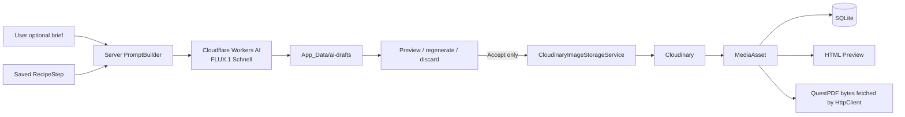

# Cloudinary media library and AI image-candidate demo

## Overview

Replace the current one-file-per-step local image mechanism with Cloudinary-backed `MediaAsset` records. Users upload real images once, browse them in `/Media`, attach an existing asset to a recipe step, and render Web/PDF through the asset record rather than a hard-coded local path.

Add one intentional AI demo: Cloudflare Workers AI running `@cf/black-forest-labs/flux-1-schnell` generates a candidate illustration for an already-saved recipe step using Cloudflare's 10,000 free Neurons/day (~150-200 free images/day). The candidate stays outside Cloudinary until the user explicitly accepts it. On acceptance, backend uploads the exact candidate bytes to Cloudinary, creates a labelled `MediaAsset`, and links it to the step.

The backend simply combines the recipe name, step description, and the user's optional brief into a clean visual prompt for FLUX.1. No complex prompt-injection sanitization or overriding guardrails are needed since this is an internal R&D authoring tool used by trusted staff.

## Approved scope

### In scope

- Cloudinary .NET SDK, server-only configuration, dependency injection, upload and destroy integration.
- Preserve the existing 5 MiB, extension, and magic-byte checks before any network upload.
- `MediaAsset` data model: provider key, HTTPS delivery URL, original file metadata, source type, caption, lifecycle state, timestamps.
- Nullable `RecipeStep.MediaAssetId` relation; one asset per step today, reusable by multiple steps.
- One-time local-image migration via an explicit local maintenance command and report for unreadable/missing legacy files.
- `/Media/Index` gallery: list, source/status filter, upload, detail context, safe delete.
- Recipe composer: upload a new asset or select a library asset for a new step; never accept both sources in one POST.
- Cloudflare Workers AI (FLUX.1 Schnell) prompt builder (concise template combining step instruction and user brief), one temporary candidate per saved step, regenerate/discard/accept flow, and user-visible provenance.
- HTML preview and QuestPDF export from Cloudinary delivery URLs.
- Tests with fake storage and fake Cloudflare AI providers; no test calls to either external service.

### Out of scope

- Multi-provider AI, image editing/reference images, multi-candidate gallery, bulk generation, prompt-history browser, cost dashboards, job queue, or automatic retry billing.
- Tags, full-text media search, folders, image editing/cropping UI, thumbnails, bulk upload, multiple assets per step.
- User accounts/roles. Current app has no auth; delete protection is reference-based only.
- A local-storage runtime fallback. `App_Data/ai-drafts` is temporary candidate staging only; it is not a user-facing store.

## Scope decision

Hold scope selected. Direct Cloudinary replacement is unsafe because the current views/PDF assume a local filename. Cloudflare Workers AI (`@cf/black-forest-labs/flux-1-schnell`) is chosen as the demo provider because of its generous 10,000 free Neurons/day allocation and clean REST API requiring no external proprietary SDK. A user must accept a candidate before Cloudinary upload, so unwanted generations neither enter the media library nor appear in PDFs.

## Architecture



### Data model

```text
MediaAsset 1 ── * RecipeStep
AiImageDraft 1 ── 0..1 MediaAsset
RecipeStep.ImageFileName is removed after legacy backfill is verified.
```

| Field | Purpose | Constraint |
|---|---|---|
| `MediaAsset.Id` | Primary key | SQLite integer |
| `StorageProvider` | Storage implementation name | `Cloudinary` for this release |
| `ProviderPublicId` | Cloudinary destroy key | unique; required |
| `DeliveryUrl` | HTTPS image URL for Web/PDF | required; max 2048 |
| `OriginalFileName` | audit/display only | sanitized display value; max 255 |
| `MimeType`, `ByteSize` | validated image metadata | MIME allowed by validator; byte size `1..5 MiB` |
| `SourceType` | `Real` or `AiIllustration` | default `Real`; label mandatory |
| `Caption` | optional user-facing image context | max 500 |
| `State` | `Active` or `DeleteFailed` | delete failures are retryable |
| `AiImageDraftId` | accepted candidate provenance | null for real uploads; unique when set |
| `RecipeStep.MediaAssetId` | optional selected asset | FK `SetNull`; indexed |
| `AiImageDraft.Id` | unguessable candidate identifier | GUID; server-generated |
| `AiImageDraft.RecipeStepId` | candidate owner | required FK |
| `PromptSnapshot`, `UserBrief` | exact accepted/rejected-generation trace | server generated; brief max 500 |
| `Model` | `@cf/black-forest-labs/flux-1-schnell` | free-tier edge diffusion model |
| `TemporaryFileName` | file below `App_Data/ai-drafts` | generated filename only; never a URL |
| `State`, `ExpiresUtc` | `Generated`, `Accepted`, `Discarded`, `Expired`, `Failed` | one active draft per step |

### Storage and generation contracts

```csharp
public interface IImageStorageService
{
    Task<StoredImage> UploadAsync(
        Stream image, ValidatedImageInfo info, CancellationToken cancellationToken = default);
    Task DeleteAsync(string providerPublicId, CancellationToken cancellationToken = default);
}

public interface IAiImageGenerator
{
    Task<GeneratedImage> GenerateAsync(
        string prompt, CancellationToken cancellationToken = default);
}
```

`CloudinaryImageStorageService` validates content before upload, sets `Folder = "recipe-hub/media"`, then persists SDK `PublicId` and `SecureUrl`. `CloudflareWorkersAiImageGenerator` calls the Cloudflare Workers AI REST API `https://api.cloudflare.com/client/v4/accounts/{AccountId}/ai/run/@cf/black-forest-labs/flux-1-schnell` via standard `HttpClient`; it decodes the returned image bytes for temporary staging, not a Cloudinary URL. Both external services use server-only credentials.

## Configuration and secrets

| Setting | Development source | Deployment source | Never do |
|---|---|---|---|
| `Cloudinary:CloudName` | `dotnet user-secrets` | `Cloudinary__CloudName` | commit credentials |
| `Cloudinary:ApiKey` | user secrets | `Cloudinary__ApiKey` | expose to Razor/JS |
| `Cloudinary:ApiSecret` | user secrets | `Cloudinary__ApiSecret` | log or return in errors |
| `Cloudflare:AccountId` | user secrets | `Cloudflare__AccountId` | expose to Razor/JS |
| `Cloudflare:ApiToken` | user secrets | `Cloudflare__ApiToken` | expose to Razor/JS |

Bind and validate both option types at startup. Fail fast with local configuration errors; redact provider errors displayed to users/logs. Packages: `CloudinaryDotNet` only. Cloudflare AI uses standard .NET `HttpClient` (no proprietary SDK needed).

## Legacy cutover

1. Add schema first; do not delete `RecipeStep.ImageFileName` in the initial migration.
2. Implement a local-only maintenance command with an explicit `--confirm` flag; do not expose an unauthenticated migration endpoint.
3. For each file: open only beneath `wwwroot/uploads/steps`, re-run the validator, upload, insert a `MediaAsset`, set `MediaAssetId`, then save the pair. Do not delete a local source until database persistence succeeds.
4. Emit succeeded/failed counts and file names. Missing/invalid files remain local references for manual repair; never silently lose the recipe step.
5. After a verified clean migration in the target environment, add a follow-up migration to remove `ImageFileName` and remove the legacy local-file renderer. The app must not perpetually carry two image paths.

## Deletion and consistency policy

- Deleting a recipe step detaches the asset; it does not delete a reusable asset.
- Media-library delete checks for every referencing step. A referenced asset is rejected with affected recipe/step count.
- For an unreferenced asset, call Cloudinary destroy first. If provider deletion fails, preserve the database row, set `State = DeleteFailed`, and show a retry action. If it succeeds, delete the database record in a transaction.
- No background generation queue exists. One bounded cleanup service only expires and removes temporary AI draft files; it never creates/retries model requests or uploads.

## Phases

| Phase | Name | Status |
|---|---|---|
| 1 | [External image foundations](./phase-01-cloudinary-storage-foundation.md) | Completed |
| 2 | [Asset data and legacy cutover](./phase-02-asset-data-and-legacy-cutover.md) | Completed |
| 3 | [Media library and recipe integration](./phase-03-media-library-and-recipe-integration.md) | Completed |
| 4 | [Cloudflare Workers AI candidate approval demo](./phase-04-cloudflare-workers-ai-candidate-demo.md) | Completed |

## Affected files

| Action | Path | Purpose |
|---|---|---|
| Modify | `src/RecipeCard.Web/RecipeCard.Web.csproj` | Add `CloudinaryDotNet` package. |
| Modify | `src/RecipeCard.Web/Program.cs` | Bind options; register Cloudinary, Cloudflare AI HTTP client, storage/HTTP services. |
| Modify | `src/RecipeCard.Web/Data/RecipeDbContext.cs` | Configure asset/draft tables, unique indexes, FKs, constraints. |
| Modify | `src/RecipeCard.Web/Models/RecipeStep.cs` | Replace filename field after verified migration with `MediaAssetId` and navigation. |
| Create | `src/RecipeCard.Web/Models/MediaAsset.cs`, `AiImageDraft.cs` | Persistent asset metadata, draft provenance, state enums. |
| Modify/Create | `src/RecipeCard.Web/Services/IImageStorageService.cs`, `CloudinaryImageStorageService.cs`, `IAiImageGenerator.cs`, `CloudflareWorkersAiImageGenerator.cs`, `AiImagePromptBuilder.cs` | Safe storage, model call, server prompt construction. |
| Create | `src/RecipeCard.Web/Pages/Media/Index.cshtml`, `Index.cshtml.cs` | Gallery, upload, filters, reference-safe delete/retry. |
| Modify | `src/RecipeCard.Web/Pages/Shared/_Layout.cshtml` | Media sidebar entry. |
| Modify | `src/RecipeCard.Web/Pages/Recipes/Edit.cshtml`, `Edit.cshtml.cs` | Upload/select media plus AI brief/candidate actions. |
| Modify | `src/RecipeCard.Web/Pages/Recipes/Preview.cshtml`, `Preview.cshtml.cs`, `Pdf/RecipePdfDocument.cs` | Render source label, remote image bytes. |
| Create | `src/RecipeCard.Web/Migrations/*MediaAsset*.cs` | Asset/draft schema and verified cutover migrations. |
| Modify/Create | `tests/RecipeCard.Web.Tests/*` | Contract, handler, migration, candidate-state tests using fakes. |

## Dependencies

- Completed `docs/plans/260923-2248-recipe-card-core/`; this follow-up supersedes only its local single-step-image decision.
- Cloudinary credentials are required before Phase 1 smoke testing.
- Cloudflare Account ID and API Token are required before Phase 4 smoke testing (free tier).
- Internet egress to Cloudinary required for upload/PDF; to Cloudflare required only for candidate generation.
- Existing files remain in `wwwroot/uploads/steps` until the local maintenance command records conversion success.

## Verification matrix

| Contract | Proof |
|---|---|
| Invalid/crafted upload never reaches Cloudinary | Unit tests assert extension, length, magic-byte rejection and fake client has no call. |
| Valid upload persists reusable asset | Handler test asserts `MediaAsset` values plus `RecipeStep.MediaAssetId`. |
| Asset selected from library can serve a second step | Razor handler test; no second provider upload. |
| Referenced asset cannot be deleted | Media handler test returns user-facing error and fake destroy is not called. |
| Cloudinary delete failure remains recoverable | Fake destroy failure leaves record as `DeleteFailed`; retry is offered. |
| Canonical prompt is server-built | Prompt-builder unit test checks step instruction and user brief combination. |
| Candidate is not uploaded prematurely | Generate/regenerate/discard tests assert zero fake-Cloudinary uploads. |
| Only acceptance creates AI media | Accept test uploads staged bytes once, creates `AiIllustration` asset/draft link, and attaches the step. |
| External failure preserves the step | Fake Cloudflare/Cloudinary failures keep existing step/media untouched and retain retryable generated draft where applicable. |

## Risks

| Risk | Control |
|---|---|
| Key leak | user-secrets/environment only; options validation; redacted logs; no Razor exposure. |
| Uploading disguised files | keep size, extension, and magic-byte validation before provider call. |
| Remote timeout during PDF | named `HttpClient` timeout; user-facing export error; no recipe data mutation. |
| Remote/SQLite transaction mismatch | upload compensation on database failure; explicit `DeleteFailed` recovery state. |
| AI image is accepted without review | candidate staging outside public/static storage; only `Accept` uploads/link it. |
| Forgotten local candidate files | expiry timestamp plus cleanup service; files outside `wwwroot`. |

## AI demo flow

1. User saves a recipe step, then opens its inline `Tạo minh họa AI` panel.
2. User may enter an optional visual brief (e.g. "nhìn từ trên xuống, ly thủy tinh").
3. `AiImagePromptBuilder` formats a clean prompt: recipe context + step instruction + user brief.
4. Backend calls Cloudflare Workers AI (`@cf/black-forest-labs/flux-1-schnell`), decodes returned bytes, writes a generated temporary file under `App_Data/ai-drafts`, and records `AiImageDraft`.
5. Razor page previews the draft through a controlled file handler. Buttons: `Tạo lại`, `Bỏ ảnh`, `Chấp nhận ảnh này`.
6. Regenerate/discard removes/supersedes the temporary draft. Neither action calls Cloudinary.
7. Acceptance revalidates state/expiry, uploads the exact temporary bytes to Cloudinary, creates `MediaAsset(SourceType = AiIllustration)`, links it to the existing step, and marks draft `Accepted`.
8. Editor, preview, and PDF always show `AI minh họa` for that asset. It never asserts that the SOP procedure occurred or is correct.
