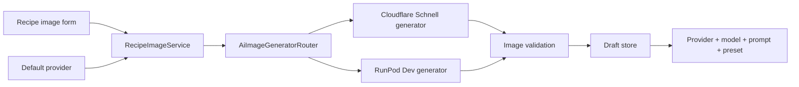

# Dual AI Provider and Services Organization Design

## Problem

The application currently uses Cloudflare FLUX.1 Schnell through a single `IAiImageGenerator`. Services are stored in one flat directory, making prompt construction, AI providers, draft storage, media handling, and PDF logic harder to locate.

Required behavior:

- Keep Cloudflare FLUX.1 Schnell.
- Add RunPod FLUX.1 Dev.
- Configure one default provider.
- Allow provider override for each generate/regenerate operation.
- Report RunPod errors without automatic fallback.
- Persist the provider and actual model used for each AI draft.
- Reorganize all files under `Services/` by domain.
- Add `Services/README.md` as a directory map.

## Evaluated approaches

| Approach | Benefit | Cost | Decision |
|---|---|---|---|
| Replace the global provider through DI | Minimal implementation | No per-request selection | Rejected |
| Provider router with separate generators | Clear ownership, testable, extensible without provider coupling | Small routing abstraction | Selected |
| One generator containing both APIs | Fewer files initially | Mixed options, payloads, errors, and job lifecycle | Rejected |

## Architecture



### Responsibilities

| Component | Responsibility |
|---|---|
| Recipe edit PageModel | Bind form, invoke recipe image service, return response |
| `RecipeImageService` | Recipe-specific AI image workflow: generate, regenerate, accept, cancel |
| `AiImageGeneratorRouter` | Resolve the selected provider to its generator |
| Cloudflare generator | Cloudflare request/response only |
| RunPod generator | RunPod submit/status/output lifecycle only |
| Prompt services | Prompt construction and translation only |
| Draft services | Temporary draft files and cleanup only |
| Media services | Image validation and permanent storage only |

The router should use a small explicit `switch` for two providers. No reflection or plugin framework.

## Target service layout

```text
Services/
├── README.md
├── Ai/
│   ├── Generation/
│   │   ├── IAiImageGenerator.cs
│   │   ├── AiImageGenerationRequest.cs
│   │   ├── AiImageProvider.cs
│   │   ├── AiImageGeneratorRouter.cs
│   │   └── AiImageOptions.cs
│   ├── Providers/
│   │   ├── Cloudflare/
│   │   │   ├── CloudflareWorkersAiImageGenerator.cs
│   │   │   └── CloudflareOptions.cs
│   │   ├── RunPod/
│   │   │   ├── RunPodAiImageGenerator.cs
│   │   │   └── RunPodOptions.cs
│   │   └── Gemini/
│   │       ├── GeminiRoundRobinPromptTranslator.cs
│   │       ├── GeminiKeyCursor.cs
│   │       └── GeminiOptions.cs
│   ├── Prompting/
│   │   ├── IAiPromptTranslator.cs
│   │   ├── AiImagePromptBuilder.cs
│   │   ├── AiPromptTranslationConstants.cs
│   │   └── CloudflareWorkersAiPromptTranslator.cs
│   └── Drafts/
│       ├── AiDraftFileStore.cs
│       └── AiDraftCleanupHostedService.cs
├── Media/
│   ├── Storage/
│   │   ├── IImageStorageService.cs
│   │   ├── ImageStorageService.cs
│   │   ├── CloudinaryImageStorageService.cs
│   │   └── CloudinaryOptions.cs
│   ├── Validation/
│   │   └── ImageValidator.cs
│   ├── Migration/
│   │   └── LegacyStepImageMigrationService.cs
│   └── AspectRatioPresetExtensions.cs
├── Recipes/
│   └── RecipeImageService.cs
└── Pdf/
    ├── RecipePdfModelFactory.cs
    └── PdfMediaLoader.cs
```

Folder movement and recipe workflow extraction must be separate phases. Folder-only movement must preserve behavior and may retain the current `RecipeCard.Web.Services` namespace initially to avoid unnecessary call-site churn.

## Services README content

`src/RecipeCard.Web/Services/README.md` must include this lookup table:

| Need to find | Open |
|---|---|
| Prompt construction | `Services/Ai/Prompting/` |
| Cloudflare API integration | `Services/Ai/Providers/Cloudflare/` |
| RunPod API integration | `Services/Ai/Providers/RunPod/` |
| Provider selection | `Services/Ai/Generation/AiImageGeneratorRouter.cs` |
| Draft storage and cleanup | `Services/Ai/Drafts/` |
| Image validation and storage | `Services/Media/` |
| Recipe image workflow | `Services/Recipes/RecipeImageService.cs` |
| Recipe PDF services | `Services/Pdf/` |

README must also state dependency direction and ownership boundaries. It must not duplicate detailed provider configuration from operations documentation.

## RunPod contract gate

Implementation must not guess the RunPod request or response schema. Before implementing the adapter:

1. Call endpoint `rfxqcmcf0se7lb` successfully using its own API Docs or Playground payload.
2. Capture a sanitized request and completed response.
3. Determine whether output is URL, Base64, object, or list.
4. Verify whether native `width` and `height` are supported.
5. Record actual output MIME type and dimensions.
6. Measure cold-start and execution behavior.

`RunPodAiImageGenerator` may only parse the observed contract.

## Provider behavior

- Default provider: Cloudflare Schnell unless configuration overrides it.
- Generate form: provider defaults from configuration and allows override.
- Regenerate form: defaults to the draft provider and allows override.
- RunPod timeout/failure: show provider-specific error; do not fallback.
- Every successful output passes `IImageValidator` before draft persistence.
- Secrets remain server-side and never appear in HTML, logs, or committed settings.

## Data changes

`AiImageDraft` stores both:

- `Provider`: stable application enum.
- `Model`: actual provider model identifier.

A database migration is required. Existing drafts need an explicit Cloudflare provider backfill or a safe migration default based on current production history.

## Aspect-ratio constraint

The current Cloudflare FLUX.1 Schnell schema exposes `prompt`, `steps`, and `seed`, not native `width` and `height`. UI must not claim native custom dimensions for that provider.

RunPod custom dimensions are enabled only after endpoint verification. A future Cloudflare crop/pad transform is separate scope and must not stretch images.

## Risks

| Risk | Mitigation |
|---|---|
| Guessed RunPod schema | Contract gate before adapter implementation |
| Large refactor obscures behavior changes | Move folders first; build/test; extract workflow second |
| Secret leakage | Environment/secret configuration; redacted errors and logs |
| Regeneration silently changes model | Persist provider and default regenerate to prior provider |
| Hidden fallback changes output | No automatic fallback |
| Folder hierarchy becomes abstraction-heavy | Explicit router, one public responsibility per file, no plugin framework |

## Success criteria

- Services directory is navigable from its README.
- Existing Cloudflare generation remains functional.
- User can select Cloudflare Schnell or RunPod Dev per generate/regenerate request.
- Configured default is used when no override is supplied.
- Draft records identify provider and model.
- RunPod lifecycle uses verified request/output fields.
- RunPod failure creates no draft and does not invoke Cloudflare.
- Both providers' output is validated before persistence.
- Relevant tests, operational documentation, and all call sites are updated.

## Next steps

1. Create detailed implementation plan.
2. Verify RunPod endpoint contract before adapter code.
3. Execute service folder reorganization as a behavior-neutral phase.
4. Extract recipe image workflow.
5. Implement provider routing and UI selection.
6. Smoke-test both real provider paths.
