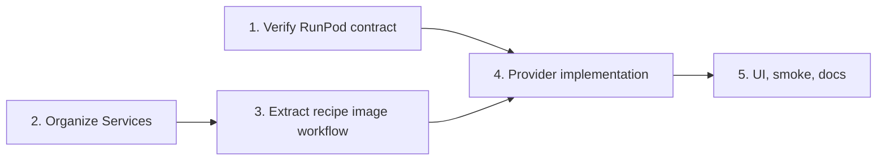

# Dual AI Image Providers and Domain-Organized Services

## Overview

Keep Cloudflare FLUX.1 Schnell and add RunPod FLUX.1 Dev behind a small explicit provider router. Users receive a configured default and may override it for each generate/regenerate operation. RunPod failures remain visible and never trigger implicit fallback.

Reorganize `src/RecipeCard.Web/Services/` by domain and add `Services/README.md`. Folder movement remains behavior-neutral before recipe workflow extraction or provider behavior changes.

Source design: [`../261008-0200-dual-ai-provider-services-design.md`](../261008-0200-dual-ai-provider-services-design.md).

## Decisions

| Area | Decision |
|---|---|
| Routing | Explicit `AiImageProvider` plus small router `switch`; no plugin/reflection framework |
| Default | Configuration default; initially Cloudflare Schnell |
| Override | Provider selectable on each generate/regenerate form |
| Failure | Provider-specific error; no automatic fallback |
| Persistence | Draft stores stable provider and actual model identifier |
| RunPod | Adapter only after observing a successful real request/response contract |
| Organization | Domain subfolders plus `Services/README.md`; no giant consolidated files |
| Refactor order | Folder-only move first, workflow extraction second, behavior change third |
| Namespaces | Preserve `RecipeCard.Web.Services` during folder-only move unless compiler evidence requires a separate namespace phase |

## Phases

| Phase | File | Outcome | Status |
|---:|---|---|---|
| 1 | [`phase-01-runpod-contract.md`](./phase-01-runpod-contract.md) | Request schema known; sanitized live response/output contract still required | In progress — live probe pending local secret |
| 2 | [`phase-02-organize-services.md`](./phase-02-organize-services.md) | Domain folders and accurate `Services/README.md`, no behavior change | Completed |
| 3 | [`phase-03-extract-recipe-image-workflow.md`](./phase-03-extract-recipe-image-workflow.md) | Thin PageModel delegating image lifecycle to `RecipeImageService` | Completed |
| 4 | [`phase-04-provider-routing-and-persistence.md`](./phase-04-provider-routing-and-persistence.md) | Router/persistence scaffold exists; implement verified RunPod HTTP adapter | In progress — blocked only on Phase 1 output fixture |
| 5 | [`phase-05-ui-smoke-and-docs.md`](./phase-05-ui-smoke-and-docs.md) | Selector exists and truthfully disables RunPod; real RunPod smoke/docs remain | In progress — real smoke blocked by Phase 4 |

## Dependencies



Phase 1 and Phase 2 may be performed independently. All tests/builds run once at each completed phase boundary, not after every file move.

## Expected file groups

```text
Services/
├── README.md
├── Ai/
│   ├── Generation/
│   ├── Providers/Cloudflare/
│   ├── Providers/RunPod/
│   ├── Providers/Gemini/
│   ├── Prompting/
│   └── Drafts/
├── Media/
│   ├── Storage/
│   ├── Validation/
│   └── Migration/
├── Recipes/
└── Pdf/
```

Do not create empty folders. Create `Services/Recipes/` only when `RecipeImageService` is introduced.

## Test strategy

- Preserve existing Cloudflare payload and output-parser tests.
- Preserve recipe final/step draft lifecycle behavior during extraction.
- Add RunPod tests from the observed contract, not guessed JSON.
- Test router selection and unsupported provider errors.
- Test default provider and explicit override precedence.
- Test RunPod queue, progress, completion, failure, timeout, cancellation, malformed output, and image validation.
- Test draft provider migration/default and regenerate provider retention.
- Smoke both real provider paths through the actual Razor form.

## Security and operations

- `RunPod__ApiKey` remains server-side secret.
- Endpoint ID may be normal configuration; API key must not enter source, HTML, logs, exception details, or test snapshots.
- Poll status with bounded delay and total timeout; honor request cancellation.
- Backend downloads URL output if the verified contract returns a URL; browser never receives provider credentials.
- Output always passes existing image validation before draft persistence.
- Record measured cold-start/execution behavior without promising fixed performance or cost.

## Out of scope

- Automatic provider fallback.
- Generic plugin marketplace.
- Load balancing across providers.
- Billing dashboard or quota accounting.
- Changing prompt semantics.
- Cloudflare crop/pad transformation.
- Refactoring all recipe CRUD into a generic recipe service.

## Success criteria

- `Services/README.md` accurately points developers to prompt, provider, draft, media, recipe-image, and PDF code.
- Existing Cloudflare flow remains operational.
- RunPod adapter matches one observed successful endpoint contract.
- Default provider works when no override is supplied.
- Generate/regenerate supports explicit Cloudflare or RunPod selection.
- Regenerate retains the prior draft provider unless explicitly changed.
- RunPod failure creates no draft and never invokes Cloudflare.
- Draft records persist provider and model.
- Both real provider paths produce validated drafts from the Razor UI.
- Build, focused tests, full test suite, and documentation checks pass.

## Execution handoff

1. Store `RunPod:ApiKey` locally with `dotnet user-secrets`; never paste it into chat or tracked JSON.
2. Execute the bounded Phase 1 probe and sanitize the completed response fixture.
3. Continue Phase 4 adapter tasks, then Phase 5 real UI smoke:

```text
/ck:cook --plan docs/plans/261008-0200-dual-ai-provider-services/plan.md
```
